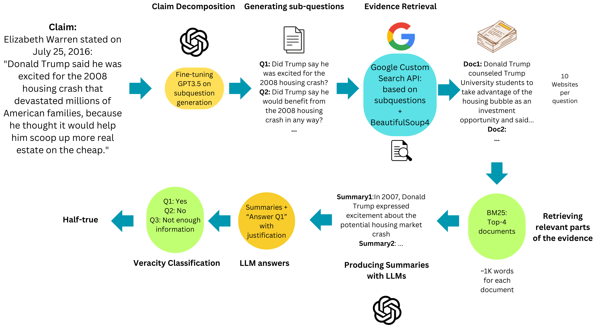

# factcheck-with-llm - Thesis



## Prerequisties

See the main folder's requirements.

## A fine-tuned model is generated in OPENAI's API

format_finetune.py file prepares the train and val data for finetuning.

```bash
export OPENAI_API_KEY="your openai key"
cd scripts
```

Create subquestions via:

```bash
python3 question_generation.py
```

Or you can use in-context-learning to generate the subquestion:

```bash
python3 -m icl_question_generator \
    --test_path "ClaimDecomp/test.jsonl" \
    --output_path "Data/1_Subquestions/subquestions_icl_gpt.jsonl" \
    --model_name "gpt-3.5-turbo" \
    --llm_type "gpt"

```

## Anyscales Endpoints are used in the following parts to use Mixtral LLMs

So need to set api key and base url. It can be done by registering in their [website](https://www.anyscale.com)

```bash
export OPENAI_BASE_URL="https://api.endpoints.anyscale.com/v1"
export OPENAI_API_KEY="YOUR_ANYSCALE_ENDPOINT_API_KEY"
```

## The Data

The data used in this project is from this GitHub Repository [subquestions-for-fact-checking](https://github.com/jifan-chen/subquestions-for-fact-checking) by Jifan Chen

## Evidence Retrieval

The script "web_api_retrieval.py" retrieves websites via Google Custom Search API, a web api key, as well as search engine id must be acquired from Google's official API, and placed in a .env file.

Google allows only 100 queries per day, therefore the code was run on a span of multiple days to acquire for 200 lines in the subquestions_finetuned.jsonl file
The final version can be accessed under websites.jsonl

### Websites Retriever

Does Web queries using Google custom search API:
And creates websites jsonl file as output.
Google Custom Search API is used and following websites are excluded from the search, as well as in the code
there is time constraints (the searches are before the claim was made). Moreover, Google Custom Search API allows only 100 free queries per day, therefore the data for the whole test set (200 claims with multiple subquestions in each) are created in about a span of a week.

```bash
python3 -m evidence.web_api_retriever \
    --subquestion_path "./Data/1_Subquestions/subquestions_icl_gpt.jsonl" \
    --websites_path "./Data/2_Websites/websites_gpt_icl.jsonl" \
    --web_api_key "Your web API goes here" \
    --search_engine_id "search engine id goes here" \
```

### Text Retriever

text_retriever.py uses BeautifulSoup to retrieve text from those websites. To run the command the arguments must be given:

```bash
python3 -m evidence.text_retriever \
    --test_path "./ClaimDecomp/test.jsonl"
    --websites_path "./Data/2_Websites/websites_gpt_icl.jsonl" \
    --output_path  "./Data/3_Answers/answers_gpt_icl.jsonl"
```

The answers can be downloaded directly via [answers.jsonl](https://drive.google.com/file/d/1hyPoPh_fHpX23tH09O2w_uDrkz3GL79A/view?usp=share_link) (1GB)

### BM25 Retriever

Also need to download nltk

```python
import nltk
nltk.download('punkt')
```

Here we segment each answer to some number of segments (with token length 1500) and retrieve the most relavent parts of the text using BM25 ranker. If segments are the same they are removed and if there is a significant overlap, they are merged, you can see the detail in the log file -> bm25.out at the very end. Initially we have 4 segments for each claim.

```bash
python -m evidence.bm25_retriever.py \
    --corpus_path "../Data/3_Answers/answers_gpt_icl"
    --original_test_path "./ClaimDecomp/test.jsonl"
    --top_docs_path "./Data/4_TopDocs/top_docs_gpt_icl.jsonl'"
```

## Summarize

Summarazies the relavent parts retrieved from BM25 and stores them in summaries_final.jsonl

```bash
python3 -m evidence.summarize \
    --corpus_path "./Data/4_TopDocs/top_docs_gpt_icl.jsonl" \
    --test_path "./ClaimDecomp/test.jsonl" \
    --output_path "./Data/5_Summaries/summaries_gpt_icl.jsonl" \
    --model_name "gpt-3.5-turbo" \
    --llm_type "gpt"
```

## Labeler

Here the summaries are given to the LLM with the subquestion to answer it with yes or no.

```bash
python3 -m labelers.labeler_llm \
    --corpus_path 'Data/5_Summaries/summaries_gpt_icl.jsonl' \
    --test_path 'ClaimDecomp/test.jsonl' \
    --subquestions_path 'Data/1_Subquestions/subquestions_icl_gpt.jsonl' \
    --output_path 'Data/6_Results/GPT/labels_gpt_icl_llm.jsonl' \
    --model_name 'gpt-3.5-turbo-0613' \
    --knowledge_base 'llm' \
    --llm_type 'anyscale or gpt'
```

## Final Verdict

Creates confusion matrix and final classification

```bash
python3 -m final_verdict \
    --labels_path 'Data/6_Results/GPT/labels_gpt_icl_llm.jsonl' \
    --classification  'Choose one ['six-way', 'three-way', 'binary']'
```
